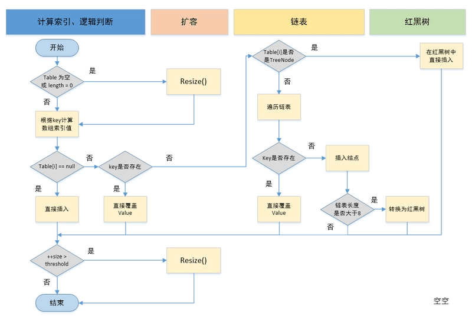

#学习笔记

##作业：
###1.HashMap总结

###2.有效的字母异位词
    /**
     * 方法1：使用哈希表，记录字符出现次数，次数不同则不是异位词，时间复杂度：o(n),空间复杂度：o(1)
     * @param s
     * @param t
     * @return
     */
    public boolean isAnagram(String s, String t) {
        if(s.length() != t.length()) {
            return false;
        }

        int[] arr = new int[26];
        for(int i = 0; i < s.length(); i++) {
            arr[s.charAt(i) - 'a']++;
        }

        for(int i = 0; i < t.length(); i++) {
            int res = --arr[t.charAt(i) - 'a'];
            if(res < 0) {
                return false;
            }
        }

        return true;
    }

    /**
     * 方法2：排序后判断两字符串是否相等,时间复杂度：o(nlogN),空间复杂度：o(n)
     * @param s
     * @param t
     * @return
     */
    public boolean isAnagram(String s, String t) {
        if(s.length() != t.length()) {
            return false;
        }
        char[] sa = s.toCharArray();
        char[] ta = t.toCharArray();
        Arrays.sort(sa);
        Arrays.sort(ta);

        for(int i = 0; i < s.length(); i++) {
            if(sa[i] != ta[i]) {
                return false;
            }
        }

        return true;
    }

###3.两数之和
    /**
     * 1.两次循环查找答案，时间复杂度最高,o(n^2);
     * 2.哈希表查找，需要用HashMap来存储数字与index的映射关系
     * 3.左右双指针向中间缩进查找
     */
    public int[] twoSum(int[] nums, int target) {
        int left = 0, right = nums.length - 1;
        while(left < right) {
            int cur = nums[left] + nums[right];
            if(cur == target) {
                return new int[]{left, right};
            } else if(cur < target) {
                left++;
            } else {
                right--;
            }
        }
        return null;
    }

###4.N 叉树的前序遍历
    /**
     * 方法1：一开始自己写的使用数据栈遍历，操作有点奇怪，stack中存的是node列表，遍历后删除遍历过的节点，代码不够简洁
     * @param root
     * @return
     */
    public List<Integer> preorder(Node root) {
        List<Integer> res = new ArrayList<>();
        if(null == root) {
            return res;
        }

        Stack<List<Node>> stack = new Stack<>();
        stack.push(new ArrayList<>(Arrays.asList(root)));
        while(!stack.empty()) {
            List<Node> nodes = stack.pop();
            if(null != nodes && !nodes.isEmpty()) {
                Node first = nodes.get(0);
                res.add(first.val);
                nodes.remove(0);

                if(!nodes.isEmpty()) {
                    stack.push(nodes);
                }

                if(null != first.children && !first.children.isEmpty()) {
                    stack.push(first.children);
                }
            }
        }
        return res;
    }

    /**
     * 方法2：题解数据栈遍历，将所有节点放到stack，从后往前遍历，代码简洁，但是不易理解
     * @param root
     * @return
     */
    public List<Integer> preorder(Node root) {
        LinkedList<Node> stack = new LinkedList<>();
        LinkedList<Integer> output = new LinkedList<>();
        if (root == null) {
            return output;
        }

        stack.add(root);
        while (!stack.isEmpty()) {
            Node node = stack.pollLast();
            output.add(node.val);
            Collections.reverse(node.children);
            for (Node item : node.children) {
                stack.add(item);
            }
        }
        return output;
    }

###5.HeapSort
    /**
     * 堆排序
     */
    public class Heap {
        private int[] a; // 数组，从下标 1 开始存储数据
        private int n;  // 堆可以存储的最大数据个数
        private int count; // 堆中已经存储的数据个数
    
        public Heap(int capacity) {
            a = new int[capacity + 1];
            n = capacity;
            count = 0;
        }
    
        /**
         * 堆排序：先构建堆，然后逐次将堆顶元素和堆底元素交换，重新构建1至n-i范围内的堆，
         * @param a
         * @param n
         */
        public void heapSort(int[] a, int n) {
            buildHeap(a, n);
            for(int i = n; i > 1; i--) {
                swap(a, 1, i);
                heapify(a, i, 1);
            }
        }
    
        public void insert(int data) {
            if(count > n) return;
            a[++count] = data;
            int i = count;
            while(i > 0 && a[i] > a[i/2]) {
                swap(a, i, i / 2);
                i = i/2;
            }
        }
    
        public void removeMax() {
            if(count == 0) return;
            a[1] = a[count--];
            heapify(a, count, 1);
        }
    
        private void heapify(int[] a, int n, int i) { // 自上往下堆化
            while(true) {
                int maxP = i;
                if(i*2 <= n && a[i] < a[i*2]) maxP = i*2;
                if(i*2 + 1 <= n && a[maxP] < a[i*2 + 1]) maxP = i*2 + 1;
                if(i == maxP) break;
                swap(a, i, maxP);
                i = maxP;
            }
        }
    
        private void buildHeap(int[] a, int n) {
            for(int i = n/2; i >= 1; i--) {
                heapify(a, n, i);
            }
        }
    
        private void swap(int[] a, int b, int c) {
            int temp = a[b];
            a[b] = a[c];
            a[c] = temp;
        }
    }

###6.字母异位词分组
    /**
     * 使用排序后的字符串作为key来设置集合
     * @param strs
     * @return
     */
    public List<List<String>> groupAnagrams1(String[] strs) {
        Map<String, List<String>> map = new HashMap<>();
        for(String s: strs) {
            char[] chars = s.toCharArray();
            Arrays.sort(chars);
            String sortedStr = String.valueOf(chars);
            if(!map.containsKey(sortedStr)) {
                List<String> list = new ArrayList<>();
                list.add(s);
                map.put(sortedStr, list);
            } else {
                map.get(sortedStr).add(s);
            }
        }
        return new ArrayList<>(map.values());
    }

    /**
     * 使用字符统计后的字符串作为key来设置集合
     * @param strs
     * @return
     */
    public List<List<String>> groupAnagrams2(String[] strs) {
        Map<String, List<String>> map = new HashMap<>();
        int[] count = new int[26];
        for(String s: strs) {
            Arrays.fill(count, 0);
            for(char c: s.toCharArray()) {
                count[c - 'a']++;
            }
            StringBuilder stringBuilder = new StringBuilder();
            for(int i: count) {
                stringBuilder.append(count[i]);
            }

            String sortedStr = stringBuilder.toString();
            if(!map.containsKey(sortedStr)) {
                List<String> list = new ArrayList<>();
                list.add(s);
                map.put(sortedStr, list);
            } else {
                map.get(sortedStr).add(s);
            }
        }
        return new ArrayList<>(map.values());
    }

###7.二叉树的中序遍历
    /**
     * 自己先实现的使用数据栈实现中序遍历，需要使用visited这样一个map记录是否访问过，有点不是很优雅
     * @param root
     * @return
     */
    public List<Integer> inorderTraversal1(TreeNode root) {
        List<Integer> list = new ArrayList<>();
        if(null == root) {
            return list;
        }

        Map<TreeNode, Boolean> visited = new HashMap<>();
        Stack<TreeNode> stack = new Stack<>();
        stack.push(root);
        while(!stack.isEmpty()) {
            TreeNode node = stack.peek();
            if(null != node.left && !visited.getOrDefault(node.left, false)) {
                visited.put(node.left, true);
                stack.push(node.left);
                continue;
            }
            stack.pop();
            list.add(node.val);

            if(null != node.right && !visited.getOrDefault(node.right, false)) {
                visited.put(node.right, true);
                stack.push(node.right);
            }
        }

        return list;
    }

    /**
     * 题解的标准答案，自己实现了下，比较优雅
     * @param root
     * @return
     */
    public List<Integer> inorderTraversal2(TreeNode root) {
        List<Integer> list = new ArrayList<>();
        if(null == root) {
            return list;
        }

        Stack<TreeNode> stack = new Stack<>();
        TreeNode node = root;
        while(null != node || !stack.isEmpty()) {
            while(null != node) {
                stack.push(node);
                node = node.left;
            }

            node = stack.pop();
            list.add(node.val);
            node = node.right;
        }

        return list;
    }

    /**
     * 递归实现
     * @param root
     * @return
     */
    public List<Integer> inorderTraversal3(TreeNode root) {
        List<Integer> list = new ArrayList<>();
        inorderTraversal3(root, list);
        return list;
    }

    private void inorderTraversal3(TreeNode root, List<Integer> list) {
        if(null == root) {
            return;
        }
        inorderTraversal3(root.left, list);
        list.add(root.val);
        inorderTraversal3(root.right, list);
    }

###8.二叉树的前序遍历
    /**
     * 数据栈实现先序遍历
     * @param root
     * @return
     */
    public List<Integer> preorderTraversal(TreeNode root) {
        List<Integer> list = new ArrayList<>();
        if(null == root) {
            return list;
        }

        Stack<TreeNode> stack = new Stack<>();
        stack.push(root);

        while(!stack.isEmpty()) {
            TreeNode node = stack.pop();
            list.add(node.val);
            if(null != node.right) {
                stack.push(node.right);
            }
            if(null != node.left) {
                stack.push(node.left);
            }
        }
        return list;
    }

    /**
     * 递归实现
     * @param root
     * @return
     */
    public List<Integer> preorderTraversal2(TreeNode root) {
        List<Integer> list = new ArrayList<>();
        preorderTraversal2(root, list);
        return list;
    }

    private void preorderTraversal2(TreeNode root, List<Integer> list) {
        if(null == root) {
            return;
        }
        list.add(root.val);
        preorderTraversal2(root.left, list);
        preorderTraversal2(root.right, list);
    }

###9.N 叉树的层序遍历  
    /**
     * 使用队列存储下一层节点，然后再遍历
     * @param root
     * @return
     */
    public List<List<Integer>> levelOrder1(Node root) {
        List<List<Integer>> lists = new LinkedList<>();
        if(null == root) {
            return lists;
        }

        List<Node> nodes = new LinkedList<>();
        nodes.add(root);

        while(!nodes.isEmpty()) {
            List<Node> childNodes = new LinkedList<>();
            List<Integer> list = new LinkedList<>();
            for(Node node: nodes) {
                list.add(node.val);
                childNodes.addAll(node.children);
            }
            lists.add(list);
            nodes = childNodes;
        }
        return lists;
    }

###10.丑数
    /**
     * 记录2、3、5三个数的因子，找到满足2a*3b*5c的最小值，a、b、c递增
     * @param n
     * @return
     */
    public int nthUglyNumber(int n) {
        int a = 0, b = 0, c = 0;
        int[] dp = new int[n];
        dp[0] = 1;
        for(int i = 1; i < n; i++) {
            int n2 = dp[a]*2, n3 = dp[b]*3, n5 = dp[c]*5;
            dp[i] = Math.min(n2, Math.min(n3, n5));
            if(dp[i] == n2) a++;
            if(dp[i] == n3) b++;
            if(dp[i] == n5) c++;
        }
        return dp[n - 1];
    }

###11.前 K 个高频元素
    /**
     * 方法1：使用排序取前k个不重复的数字，但是时间复杂度不严格小于等于nlogn;
     * 方法2：用map计数后使用桶排序，取前k个次数出现最多的数字；
     * 方法3：用map计数，使用最小堆维护前k个次数出现最多的数字；
     *
     * @param nums
     * @param k
     * @return
     */
    public int[] topKFrequent(int[] nums, int k) {
        Map<Integer, Integer> map = new HashMap<>();
        for(int a: nums) {
            map.put(a, map.getOrDefault(a, 0) + 1);
        }

        PriorityQueue<Integer> priorityQueue = new PriorityQueue<>(Comparator.comparingInt(map::get));
        for(int key: map.keySet()) {
            if(priorityQueue.size() < k) {
                priorityQueue.add(key);
            } else if(map.get(key) > map.get(priorityQueue.peek())) {
                priorityQueue.remove();
                priorityQueue.add(key);
            }
        }

        int[] res = new int[k];
        int i = 0;
        while(!priorityQueue.isEmpty()) {
            res[i++] = priorityQueue.remove();
        }
        return res;
    }

